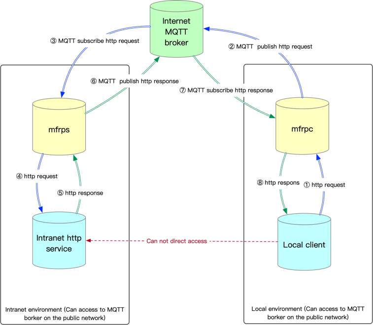

An FRP tool implemented based on MQTT.



 How to use
```bash
git clone URL_ADDRESS
cd mfrp
python3 -m venv venv
source venv/bin/activate
pip install -r requirements.txt
```

 How to run
```bash
# Step 1 Modify the configuration and start mfrps.py in the internal network environment
python3 mfrps.py

# Step 2 Start mfrpc.py in the local environment
python3 mfrpc.py
```

